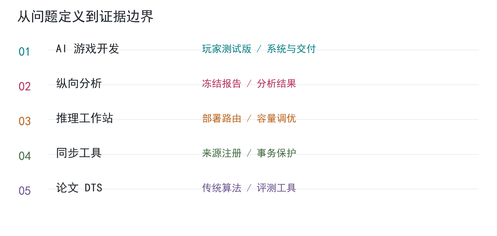

# 匿名个人作品集

AI 应用工程 · 数据分析 | 中文案例与项目骨架

五个项目，以 **AI 协作开发的离线刷宝 ARPG** 为重点，展示已交付的玩家测试版、工具与报告。本作品集做了专门的视觉设计，审美重点在信息层级、紧凑排版和方法图可读性；具体成果与贡献按项目说明。



## 项目与阅读路线

- AI 应用工程：[AI 游戏开发](projects/05-game/README.md) → [推理工作站](projects/02-runtime/README.md) → [同步工具](projects/03-governance/README.md)。
- 数据分析：[纵向分析](projects/01-analysis/README.md) → [DTS 评测](projects/04-hangman/README.md) → [知识治理](projects/03-governance/README.md)。

| 项目 | 重点 | 已完成阶段 |
| --- | --- | --- |
| [离线刷宝 ARPG](projects/05-game/README.md) | 重点项目：通过 AI 协作完成游戏系统与玩家测试版 | 2026-10-06 玩家测试版及 UI 修复阶段完成；本轮只读核验 |
| [纵向行为数据分析](projects/01-analysis/README.md) | 交付冻结分析报告、验证脚本与结论审计 | 2026-07-28 冻结报告；本轮只读复核 |
| [本地 AI 推理工作站](projects/02-runtime/README.md) | 控制器、模型路由与容量调优的阶段交付 | 2026-10-07 调优记录；本轮只读复核 |
| [知识库与规则同步工具](projects/03-governance/README.md) | 来源注册、受限同步和冲突保护的实现阶段 | 当前登记库与规范源；2026-10-08 只读复核 |
| [Hangman Decision Tree Solver](projects/04-hangman/README.md) | 毕业论文项目：DTS、FRQ、RC 与传统实验工具 | 传统算法与评测工具实现阶段完成；2026-10-08 只读核对 |

## 仓库结构

```text
README.md
portfolio.pdf
projects/
  01-analysis/   # 冻结分析方法与数据准备骨架
  02-runtime/    # 历史调优与运行契约骨架
  03-governance/ # 规则实现与事务保护骨架
  04-hangman/    # 论文 DTS 与传统算法评测
  05-game/       # AI 游戏开发、测试版与 Godot 规则骨架
docs/           # 贡献与证据边界
assets/         # 总览图
```

各项目包含说明、关键代码、结构接口、独立检查回执和方法图。安全骨架保留重点处理逻辑与自检，使用合成输入；原数据、完整原工程和真实环境参数不随包分发。Individual project 仅展示论文范围中的 DTS 与传统比较方法。

## 阅读与复现

- [14 页综合 PDF](portfolio.pdf)
- [AI 变更记录](AI_CHANGELOG.md)
- [个人贡献](docs/contribution.md) · [证据与局限](docs/evidence.md) · [素材说明](ASSETS.md)

Python 3.10+，仅使用标准库，在根目录分别运行：

```text
python -B projects/01-analysis/src/longitudinal.py
python -B projects/02-runtime/src/runtime_contract.py
python -B projects/03-governance/src/scoped_update.py
python -B projects/04-hangman/src/hangman_fairness.py
python -B projects/05-game/src/game_rules.py
```

游戏还包含 [Godot 骨架检查](projects/05-game/docs/godot-checks.md)，可用 Godot 4.7.1 打开 `projects/05-game/godot/project.godot`，验证制作规则；它不是完整游戏的试玩替代品。

研究图表与数字全部合成，仅说明方法；不代表真实项目成绩。游戏检查数字来自已保存的历史验收，不代表本轮复跑。架构图为原创重绘。阶段完成不代表全面复测。
