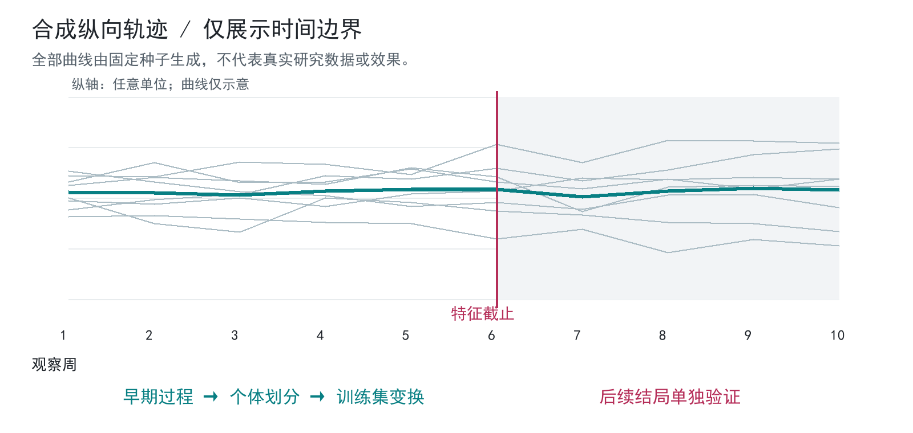

# 纵向行为数据分析

交付冻结分析报告、验证脚本与结论审计

阶段：2026-07-28 冻结报告；本轮只读复核  
证据：A01-A04 / C01

## 已完成成果

原阶段成果：冻结分析报告与验证边界。公开骨架：纵向特征准备与泄漏保护。

## 问题

多时点行为数据容易出现身份匹配错误、时间泄漏和事后选模。目标是判断早期过程能否形成稳定、可解释的响应结构，并检查它对后续结局的适用范围。

## 个人职责

本人审核数据口径，定义过程特征 X 与结局 Y，提出交叉验证、置换检验和阴性结果保留要求；分析代码由 AI 辅助实现。

## 方案

### 先冻结时间边界

按个体匹配纵向记录；先定义观察窗口、结局时点和缺失规则，再构建过程均值与变化斜率。结局之后的字段不进入特征。

### 把选模放进验证循环

外层保留验证样本，特征变换与模型选择仅使用内层训练数据。对比结局无关结构，避免把使用 Y 挑选的因子误当成外部预测证据。

### 分开验证四件事

用重抽样检查结构复现；用锁定的后续时点检查累计关联；用基线增量和未来增量检查信息边界；用置换检验检查偶然关系。

## 证据与核验范围

历史冻结报告、完成度审计、证据追溯及验证脚本相互对应。报告保留严格外层预测、未来增量和部分领域判别的阴性结果。本轮检查文档与实现，没有重新运行原始研究，也不公开真实数值。

## 局限

结构在既有数据中复现，不等于对新个体预测有效；累计关联不等于主动改变因素会产生改善。未进行随机操纵，不能声称因果机制或个体处方已经验证。

## 公开骨架

精选示例使用固定种子的独立合成纵向记录，演示时间截止、个体划分及训练集标准化。它不复现原研究的潜变量模型；图中所有曲线与数值仅用于说明方法，不是真实研究成绩。

[代码](src/longitudinal.py) · [结构与接口](docs/architecture.md) · [检查回执](docs/checks.md)

运行：`python -B projects/01-analysis/src/longitudinal.py`（在仓库根目录，Python 3.10+）。

## 展示设计

本展示做了专门的视觉设计，审美重点是清晰的信息层级、紧凑排版和方法图可读性。图为合成或原创重绘，展示效果不作为原系统性能证据。

技术：Python / 纵向特征 / 重抽样 / 外层验证 / 置换 / 数据审计

[返回总览](../../README.md) · [贡献说明](../../docs/contribution.md) · [证据边界](../../docs/evidence.md)
