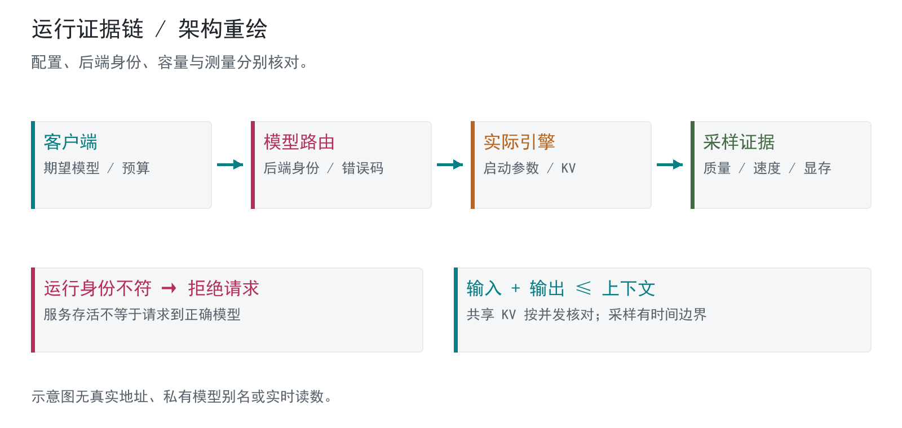

# 本地 AI 推理工作站

控制器、模型路由与容量调优的阶段交付

阶段：2026-10-07 调优记录；本轮只读复核  
证据：R01-R03 / C02

## 已完成成果

原阶段成果：历史容量调优与检索验收记录。公开骨架：纯函数运行契约。

## 问题

本地模型、路由器和客户端各自持有配置，界面显示正确时仍可能请求到错误后端。长上下文还同时受输入、输出预算、共享 KV 与桌面显存负载影响。

## 个人职责

本人确定部署需求、验收条件和容量取舍，审核诊断记录；AI 辅助实现控制器、模型路由及测试。阶段成果来自保存的调优与部署记录。

## 方案

### 核对实际服务

把进程身份、启动参数、后端模型清单和客户端期望串起来核对。通用路由实现会拒绝未加载模型，后端不可用与模型不匹配具有不同错误状态。

### 容量按真实负载选择

上下文包括输入与输出预算；共享 KV 容量需与并发一起解释。调优记录保留不合格候选，直接采样空闲显存，并承认桌面负载变化使跨轮比较不完全受控。

### 正确性与速度分开

冷输入检索、生成速度、显存余量和部署文件一致性分别验收。接纳大输出预算不等于实际生成同样长度，检索正确也不等于全面长文推理质量。

## 证据与核验范围

保存的调优记录包含冷输入校准、分散检索、实际引擎事件、显存采样及部署散列核对；通用控制器和路由源码提供配置与后端核对逻辑。记录同时说明一个既有运行时夹具失败，因此不能写成整套工作台测试通过。

## 局限

历史测量只适用于当时版本和桌面负载。本轮未复测；短采样可能漏掉瞬时峰值。公开图仅为架构重绘，不是运行截图，也不保留机器路径、模型私有别名或内部服务地址。

## 公开骨架

纯函数示例检查后端身份、上下文预算、并发 KV 容量与余量门槛；输入是合成对象，不连接服务。它只展示验收规则，不模拟真实引擎的显存分配。

[代码](src/runtime_contract.py) · [结构与接口](docs/architecture.md) · [检查回执](docs/checks.md)

运行：`python -B projects/02-runtime/src/runtime_contract.py`（在仓库根目录，Python 3.10+）。

## 展示设计

本展示做了专门的视觉设计，审美重点是清晰的信息层级、紧凑排版和方法图可读性。图为合成或原创重绘，展示效果不作为原系统性能证据。

技术：C# / JavaScript / 本地推理 / 模型路由 / KV / 运行诊断

[返回总览](../../README.md) · [贡献说明](../../docs/contribution.md) · [证据边界](../../docs/evidence.md)
