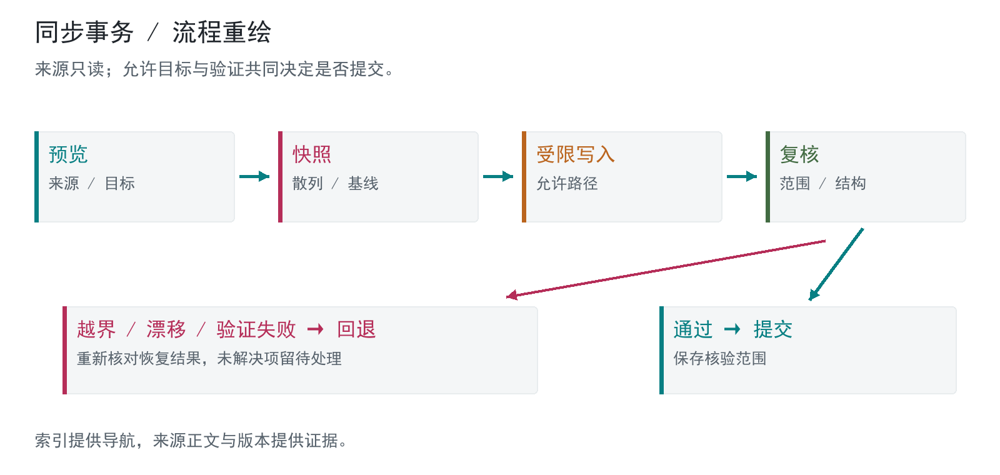

# 知识库与规则同步工具

来源注册、受限同步和冲突保护的实现阶段

阶段：当前登记库与规范源；2026-10-08 只读复核  
证据：K01-K04 / C03

## 已完成成果

原阶段成果：来源注册、事务保护与范围检查实现。公开骨架：内存事务与冲突保护。

## 问题

知识库、项目源码与多种工具的规则副本容易漂移。直接覆盖会丢掉用户修改，而只保存摘要会让后续结论失去原始依据。

## 个人职责

本人制定来源保护、允许修改范围和冲突停止规则，审核同步结果；AI 辅助实现事务脚本、规则同步与范围测试。

## 方案

### 注册表定义来源

每次读取当前注册表，以实际 source_path 定位材料。源码、受保护知识与生成的进度材料分开；每条结论保留来源和日期。

### 事务保护写入

先预览，再快照与建立允许目标。完成时比较前后散列，并运行结构验证；越界或验证失败触发回退。回退结果也需要核对。

### 规范源与冲突管理

Harness 从规范源同步受管规则。精确目标选择不能绕过内容校验和漂移保护；预览之后来源改变会使旧计划失效。系统或插件管理的资源不进入受管修改。

## 证据与核验范围

知识库事务脚本的 finish 路径检查 changed 与 allowed_targets，异常时恢复快照。Harness 的范围同步测试覆盖未选文件、空选择、未知目标、目标漂移和预览后来源变更。另一项目同步工具有独立来源、受管清单与远端冲突策略，不与全局 Harness 混为一体。

## 局限

本轮只读核对源码和已有记录，未运行实际同步。覆盖全部登记库文件不代表已独立复测全部历史结论。原项目与知识库不随作品集发布。

## 公开骨架

内存示例使用允许路径、快照、散列前置条件和验证回退，演示选定文件更新及异常保护。它不写磁盘，不替代生产事务日志、并发锁或崩溃恢复。

[代码](src/scoped_update.py) · [结构与接口](docs/architecture.md) · [检查回执](docs/checks.md)

运行：`python -B projects/03-governance/src/scoped_update.py`（在仓库根目录，Python 3.10+）。

## 展示设计

本展示做了专门的视觉设计，审美重点是清晰的信息层级、紧凑排版和方法图可读性。图为合成或原创重绘，展示效果不作为原系统性能证据。

技术：Obsidian / Python / PowerShell / SHA-256 / 注册表 / 事务 / 冲突

[返回总览](../../README.md) · [贡献说明](../../docs/contribution.md) · [证据边界](../../docs/evidence.md)
