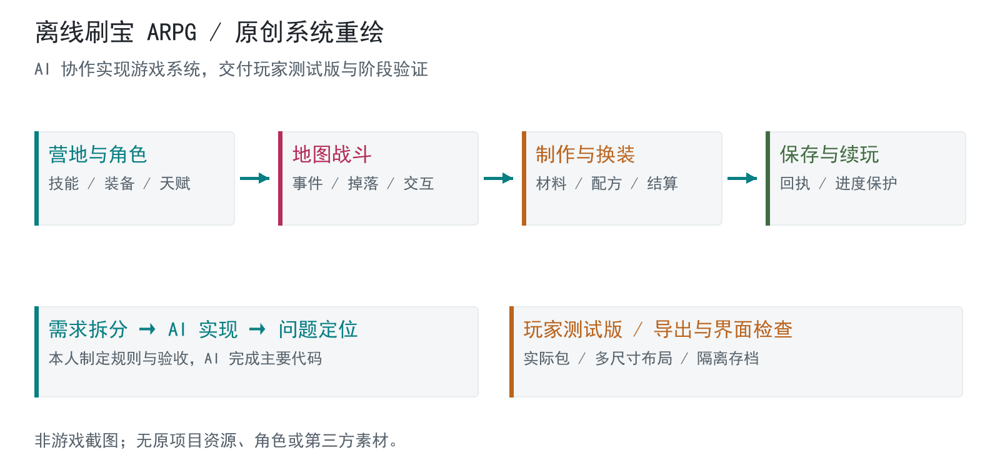

# 离线刷宝 ARPG

重点项目：通过 AI 协作完成游戏系统与玩家测试版

阶段：2026-10-06 玩家测试版及 UI 修复阶段完成；本轮只读核验  
证据：G01 / G04-G07 / C01

## 已完成成果

原阶段成果：离线 ARPG 系统与玩家测试版，界面遮挡修复及有限矩阵检查。公开骨架：制作事务、奖励幂等、进度保护与 Godot 领域规则。

## 问题

制作一款 Windows 离线刷宝 ARPG：玩家从营地进入地图，战斗获得装备与材料，制作、换装并继续挑战。项目需要把战斗、技能、背包、制作、天赋和存档连成可交付的玩法循环。

## 个人职责

本人负责游戏需求、系统规则、体验取舍与验收方向，利用 AI 推进主要代码实现、问题诊断和迭代。展示重点是组织 AI 完成复杂项目并审核交付，非独立编写全部代码。

## 方案

### 已接通玩法与系统

角色、技能、装备、制作、地图事件与存档形成关联；训练营用独立职业、等级和种子复现玩法。物品与奖励必须一次结算，重进不能重复领取。

### 完成界面遮挡修复

HUD 按实际卡片高度布局；窄窗口重排装备与数值；天赋页分区，制作字段滚动并固定操作。五种窗口尺寸与动态高度进入同一检查矩阵。

### 交付玩家测试版

导出原生应用及测试 ZIP，核对实际导出包的图标、技能和能力锁；使用独立双角色存档与隔离启动验证，逐文件核对发布包散列。

## 证据与核验范围

玩家测试版与 UI 修复报告记录：135 个布局样本无几何诊断，14 份定向回归及内容检查退出码为 0；实际导出包 62 个物品与 20 个技能可见，隔离双角色存档检查通过。原生应用两次隔离启动及 ZIP 散列核对通过。以上是历史阶段记录，本轮未重新启动游戏或复跑原测试。

## 局限

这些结果仅覆盖当时玩家测试版与有限 UI 状态；不等于商业发布、全部动态界面或长时间性能已验收。公开包只提供重写骨架与原创示意，不分发原游戏或授权未核实的素材。

## 公开骨架

安全骨架用合成角色演示制作扣材、幂等奖励、事务失败恢复和旧快照保护；Godot 骨架展示领域规则与验证入口。示意图为原创重绘，不是原游戏截图。

[代码](src/game_rules.py) · [结构与接口](docs/architecture.md) · [检查回执](docs/checks.md)

运行：`python -B projects/05-game/src/game_rules.py`（在仓库根目录，Python 3.10+）。

## 展示设计

本展示做了专门的视觉设计，审美重点是清晰的信息层级、紧凑排版和方法图可读性。图为合成或原创重绘，展示效果不作为原系统性能证据。

技术：Godot / GDScript / 系统规则 / 存档事务 / 回归 / 交互验收

[返回总览](../../README.md) · [贡献说明](../../docs/contribution.md) · [证据边界](../../docs/evidence.md)
